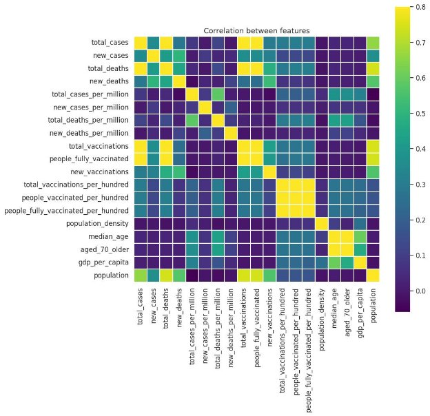
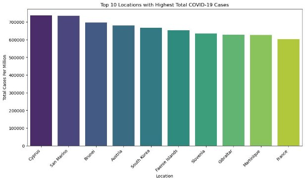
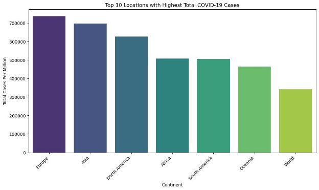

# Covid Dataset

Course Name : Data Science 
Name : Alireza Rahmati 

## Introduction :

The COVID-19 pandemic has been a global health crisis that has profoundly affected populations around the world. Amidst the myriad factors influencing the severity and outcome of COVID-19 cases, understanding the potential correlation between smoking rates and total deaths is of considerable interest. This project embarks on an exploratory data analysis (EDA) journey using a comprehensive COVID-19 dataset to unravel insights into the relationship between smoking habits and the impact on mortality rates.

The dataset under scrutiny encompasses a wealth of information, spanning various countries, territories, and regions. Key variables such as "male\_smokers," "female\_smokers," and "total\_deaths\_per\_million" provide crucial insights into the potential associations between smoking prevalence and COVID-19-related fatalities. Leveraging statistical analysis and data visualization techniques, this project aims to shed light on whether a correlation exists between smoking rates and the severity of the pandemic's impact on different populations. The investigation unfolds with an examination of the overall distribution of COVID-19 cases, identifying the highest-impacted countries and regions. Subsequently, the focus narrows down to the examination of smoking habits, introducing scatter plots to visualize the correlation between male and female smoking rates and total deaths. Further analysis involves exploring the correlation coefficients and patterns through pair plots, offering a comprehensive overview of the relationships between these critical variables.

The findings from this project not only contribute to our understanding of the COVID-19 pandemic but also provide valuable insights for public health initiatives and policies. By examining the intricate interplay between smoking habits and mortality rates, we strive to contribute to the ongoing dialogue on effective strategies to mitigate the impact of the virus on global populations.

## Data Preprocessing :

Initially, we undertook the task of cleaning our dataset, addressing missing values, and managing outliers.

Firstly, let's examine the presence of missing values within our dataset and review the characteristics of our columns.

iso\_code 0 continent 16900 location 0 date 0 total\_cases 38009 new\_cases 9610 new\_cases\_smoothed 10869 total\_deaths 59728 new\_deaths 9558 new\_deaths\_smoothed 10788 total\_cases\_per\_million 38009 new\_cases\_per\_million 9610 new\_cases\_smoothed\_per\_million 10869 total\_deaths\_per\_million 59728 new\_deaths\_per\_million 9558 new\_deaths\_smoothed\_per\_million 10788 reproduction\_rate 170648 icu\_patients 317722 icu\_patients\_per\_million 317722 hosp\_patients 316374 hosp\_patients\_per\_million 316374 weekly\_icu\_admissions 345192 weekly\_icu\_admissions\_per\_million 345192 weekly\_hosp\_admissions 332074 weekly\_hosp\_admissions\_per\_million 332074 total\_tests 276078 new\_tests 280062 total\_tests\_per\_thousand 276078 new\_tests\_per\_thousand 280062 new\_tests\_smoothed 251500 new\_tests\_smoothed\_per\_thousand 251500 positive\_rate 259538 tests\_per\_case 261117 tests\_units 248677 total\_vaccinations 275738 people\_vaccinated 279158 people\_fully\_vaccinated 282478 total\_boosters 307510 new\_vaccinations 289739 new\_vaccinations\_smoothed 172810 total\_vaccinations\_per\_hundred 275738 people\_vaccinated\_per\_hundred 279158 people\_fully\_vaccinated\_per\_hundred 282478 total\_boosters\_per\_hundred 307510 new\_vaccinations\_smoothed\_per\_million 172810 new\_people\_vaccinated\_smoothed 173044 new\_people\_vaccinated\_smoothed\_per\_hundred 173044 stringency\_index 157814 population\_density 53649 median\_age 74812 aged\_65\_older 84603 aged\_70\_older 77626 gdp\_per\_capita 80382 extreme\_poverty 178166 cardiovasc\_death\_rate 79731 diabetes\_prevalence 65700 female\_smokers 148615 male\_smokers 151429 handwashing\_facilities 220387 hospital\_beds\_per\_thousand 112033 life\_expectancy 28381 human\_development\_index 88212 population 0 excess\_mortality\_cumulative\_absolute 343254 excess\_mortality\_cumulative 343254 excess\_mortality 343254 excess\_mortality\_cumulative\_per\_million 343254 dtype: int64

We observe a significant number of missing values in certain columns, considering the overall size of our dataset. Given the relatively modest dataset size, outright removal of entries with missing values may not be the most suitable approach. Instead, our strategy involves tailoring specific methods to handle missing values for each column individually.

Upon closer inspection, it appears that missing values in the "continent" column might be compensated for by information present in the "location" column for certain rows. These entries in the "location" column may contain continent-related values. As part of our data handling strategy, we will explore leveraging this information to fill in the missing values in the "continent" column wherever applicable.

We have addressed missing values in the "continent" column by employing a strategy that leverages information from the "location" column where applicable. This approach enables us to fill in missing continent values based on the content of the corresponding "location" entries.

In certain numerical columns of the dataset, particularly those indicative of cumulative counts such as "total\_cases," the absence of data in the initial stages of the pandemic collection period results in null values. To address this, we have implemented a strategy in our code to substitute these null values with zeros, considering that no data was collected during these early time points.

For columns like "population\_density" and "median age," where missing values were encountered, we opted to impute these null values with the mean of their respective columns. This strategy allows us to fill in the missing data points with a representative measure, contributing to a more comprehensive analysis while preserving the integrity of our dataset.

Additionally, we have standardized the format of the date column by converting it to the datetime standard. This ensures consistency and facilitates seamless temporal analysis within our dataset.

Concluding our data preprocessing efforts, we have successfully cleaned and prepared the columns for analysis. The handling of missing values, outliers, and the application of appropriate strategies tailored to each column have resulted in a refined dataset that is now primed for further exploration and insights.

iso\_code 0 continent 0 location 0 date 0 total\_cases 0 new\_cases 0 new\_cases\_smoothed 10869 total\_deaths 0 new\_deaths 0 new\_deaths\_smoothed 10788 total\_cases\_per\_million 0 new\_cases\_per\_million 0 new\_cases\_smoothed\_per\_million 10869 total\_deaths\_per\_million 0 new\_deaths\_per\_million 0 new\_deaths\_smoothed\_per\_million 10788 reproduction\_rate 170648 icu\_patients 0 icu\_patients\_per\_million 0 hosp\_patients 0 hosp\_patients\_per\_million 0 weekly\_icu\_admissions 0 weekly\_icu\_admissions\_per\_million 0 weekly\_hosp\_admissions 0 weekly\_hosp\_admissions\_per\_million 0 total\_tests 0 new\_tests 0 total\_tests\_per\_thousand 276078 new\_tests\_per\_thousand 280062 new\_tests\_smoothed 251500 new\_tests\_smoothed\_per\_thousand 251500 positive\_rate 0 tests\_per\_case 261117 tests\_units 248677 total\_vaccinations 0 people\_vaccinated 279158 people\_fully\_vaccinated 0 total\_boosters 307510 new\_vaccinations 0 new\_vaccinations\_smoothed 172810 total\_vaccinations\_per\_hundred 0 people\_vaccinated\_per\_hundred 0 people\_fully\_vaccinated\_per\_hundred 0 total\_boosters\_per\_hundred 307510 new\_vaccinations\_smoothed\_per\_million 172810 new\_people\_vaccinated\_smoothed 173044 new\_people\_vaccinated\_smoothed\_per\_hundred 173044 stringency\_index 157814 population\_density 0 median\_age 0 aged\_65\_older 0 aged\_70\_older 0 gdp\_per\_capita 0 extreme\_poverty 178166 cardiovasc\_death\_rate 0 diabetes\_prevalence 65700 female\_smokers 0 male\_smokers 0 handwashing\_facilities 0 hospital\_beds\_per\_thousand 0 life\_expectancy 0 human\_development\_index 88212 population 0 excess\_mortality\_cumulative\_absolute 343254 excess\_mortality\_cumulative 343254 excess\_mortality 343254 excess\_mortality\_cumulative\_per\_million 343254 dtype: int64

## EDA :

For the Exploratory Data Analysis (EDA), it is imperative to begin by examining the correlation matrix.

This allows us to discern the correlations between different columns, particularly highlighting those with substantial associations with total deaths, total cases, and other critical variables.

Let's proceed to identify and explore the top 10 locations with the highest number of total cases.

Now, let's examine the temporal changes in the total cases for these top 10 locations over time.

Expanding our temporal analysis, let's visualize the total cases over time. This overarching perspective will provide insights into the trajectory of COVID-19 cases globally, allowing us to observe patterns and trends that have unfolded throughout the course of the pandemic.

And for countries :

And for total deaths :

However, assessing total cases alone may not provide a comprehensive perspective, as regions with larger populations naturally tend to report higher total cases. To address this, we will delve into the analysis of total cases per million, offering a more insightful and standardized measure for the top 10 locations.

This approach yields a more nuanced understanding. Notably, by considering total deaths per million, we observe that Cyprus and San Marino emerge as locations with the highest mortality rates. This refined metric provides a more meaningful comparison, accounting for population differences among the top 10 locations.

Extending our analysis to a continental level, we will investigate and visualize the continents with the highest number of total cases per million. This broader perspective will offer insights into the distribution of COVID-19 impact across continents, accounting for population differences.

Expanding our exploration, we will now examine the visualization of total deaths per million for continents. This analysis provides a comprehensive overview of the impact of COVID-19 on different continents, considering population-adjusted metrics for a more accurate assessment.

The visualization underscores a notable trend, with Europe and Asia consistently ranking among the top continents in both total deaths and total cases per million. This observation highlights the significant impact of COVID-19 on these continents, a crucial aspect to consider in our broader analysis.

With our focus on continents experiencing the highest numbers of total deaths and cases, an intriguing dimension to explore is the life expectancy across these continents. Examining life expectancy in this context may offer valuable insights into potential correlations between the impact of COVID-19 and overall health indicators.

The correlation between Europe's higher life expectancy and elevated counts of total deaths and cases is indeed noteworthy. This observation prompts further investigation into the intricate relationship between a region's health indicators, such as life expectancy, and its vulnerability to the impact of the COVID-19 pandemic.

Turning our attention to diabetes prevalence, we will now explore how this health factor varies across continents. Investigating diabetes prevalence can provide valuable context to understand potential contributing factors to the differential impact of COVID-19 across regions.

Shifting our focus to the influence of smoking habits, we aim to assess the impact on the number of total deaths per million. This exploration allows us to discern any potential correlation between smoking rates and the severity of COVID-19 outcomes, providing valuable insights into the broader health dynamics at play.

The discernible impact of the number of smokers on the total number of deaths underscores the relevance of smoking habits as a potential contributing factor to the severity of COVID-19 outcomes. This finding adds a crucial layer to our understanding of the various factors influencing the pandemic's impact on different populations.

Building on our exploration, we are eager to delve into the distribution of new cases over time for the top 10 countries with the highest total cases. This detailed examination will offer a nuanced understanding of how the pattern of new cases has evolved within these highly impacted nations throughout the pandemic.

The observation of a surge in new cases at the onset of the pandemic aligns with the global pattern seen in various regions. This insight emphasizes the critical early stages when the virus rapidly spread, influencing the subsequent trajectory of the pandemic in the top 10 highly affected countries.

Transitioning to the impact of vaccination, we aim to examine its influence on new deaths. This analysis will shed light on the effectiveness of vaccination campaigns in mitigating the severity of COVID-19 outcomes, offering crucial insights into the evolving dynamics of the pandemic.

The discernible trend, where the increase in total vaccination correlates with a decrease in the number of new deaths, aligns with expectations. This observation supports the notion that widespread vaccination efforts contribute to reducing the severity of COVID-19 outcomes, showcasing a positive impact on public health.

The visual representation in the lower plot effectively illustrates the notable impact of total vaccination on both new cases and deaths. This observation reinforces the positive relationship between widespread vaccination coverage and a reduction in the severity of COVID-19 outcomes, further emphasizing the importance of vaccination efforts in managing the pandemic.

Turning our attention to the impact of vaccination coverage, we will identify and explore the country with the highest number of fully vaccinated individuals. This analysis aims to spotlight nations that have achieved significant milestones in their vaccination campaigns, providing insights into successful vaccination strategies and their potential impact on public health outcomes.

As a concluding visualization, let's examine the global distribution of total deaths and total cases through a map representation. This comprehensive overview will provide a visual understanding of the varying impact of the COVID-19 pandemic across different regions, encapsulating the cumulative toll on both total deaths and total cases.

## Conclusion :

In conclusion, this exploratory data analysis of the COVID-19 dataset has unveiled crucial insights into the multifaceted impact of the pandemic. We observed distinct patterns in total cases and deaths, with notable disparities among continents and countries. Health indicators such as life expectancy and diabetes prevalence emerged as influential factors, while the profound effect of vaccination on mitigating new cases and deaths became evident. The analysis also highlighted the correlation between smoking rates and COVID-19 severity.

As we navigate through the complexities of the pandemic, understanding these patterns becomes pivotal for informed decision-making and effective public health strategies. This project not only provides a snapshot of the current state of the pandemic but also serves as a foundation for ongoing research and proactive measures to address the evolving challenges posed by COVID-19. Moving forward, continual monitoring and analysis will be essential for adapting strategies and shaping a collective response to this global health crisis.
